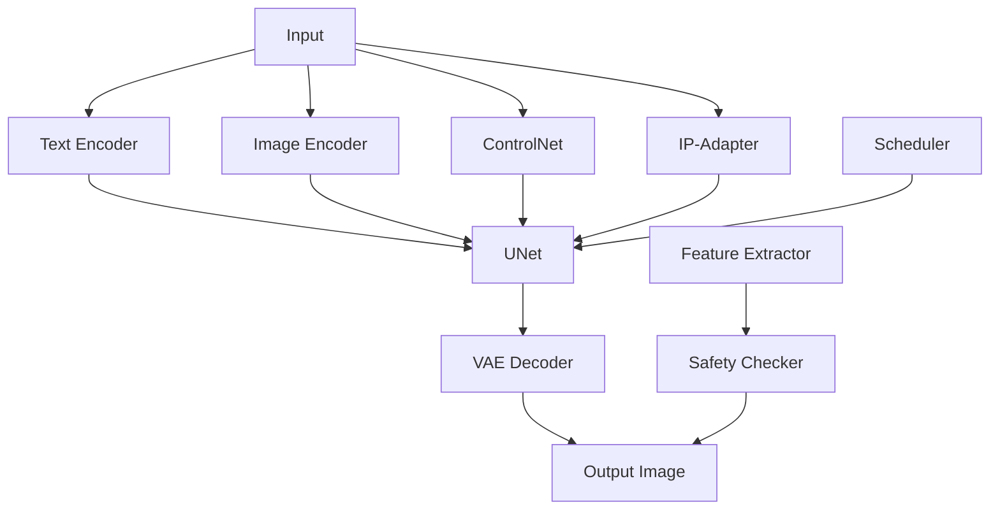

# Diffusers 框架架构梳理

##️ 框架概述

Diffusers 是 Hugging Face 提供的统一扩散模型框架，支持多种 Pipeline 类型和组件组合。

## Pipeline 类型分类

### 按功能分类

```python
from diffusers import (
    # 文本到图像
    StableDiffusionPipeline,                    # 基础 T2I
    StableDiffusionXLPipeline,                 # SDXL T2I
    
    # 图像到图像
    StableDiffusionImg2ImgPipeline,            # 基础 I2I
    StableDiffusionXLImg2ImgPipeline,          # SDXL I2I
    StableDiffusionControlNetImg2ImgPipeline,  # ControlNet I2I
    StableDiffusionXLControlNetImg2ImgPipeline, # SDXL + ControlNet I2I
    
    # 图像修复
    StableDiffusionInpaintPipeline,            # 基础 Inpaint
    StableDiffusionXLInpaintPipeline,          # SDXL Inpaint
    
    # 视频生成
    StableVideoDiffusionPipeline,              # 视频生成
    
    # 其他
    StableDiffusionUpscalePipeline,            # 图像放大
    StableDiffusionLatentUpscalePipeline,      # 潜在空间放大
)
```

## 🧩 核心组件架构

### 组件层次结构



### 组件分类

#### 核心模型组件 (必选)
- **UNet**: 主生成模型
- **VAE**: 图像编码/解码器
- **Text Encoder**: 文本编码器

#### 控制组件 (可选)
- **ControlNet**: 结构控制
- **IP-Adapter**: 风格控制
- **LoRA**: 风格微调
- **T2I-Adapter**: 文本到图像适配器

#### 辅助组件 (可选)
- **Safety Checker**: 内容安全检查
- **Feature Extractor**: 特征提取器
- **Scheduler**: 采样调度器

## 🔄 Pipeline 组件对比

| Pipeline 类型 | UNet | VAE | Text Encoder | ControlNet | IP-Adapter | Image Input |
|---------------|------|-----|--------------|------------|------------|-------------|
| **T2I** | ✅ | ✅ | ✅ | ❌ | ❌ | ❌ |
| **I2I** | ✅ | ✅ | ✅ | ❌ | ❌ | ✅ |
| **ControlNet I2I** | ✅ | ✅ | ✅ | ✅ | ❌ | ✅ |
| **SDXL I2I** | ✅ | ✅ | ✅ | ❌ | ❌ | ✅ |
| **SDXL + ControlNet + IP** | ✅ | ✅ | ✅ | ✅ | ✅ | ✅ |

## Image-to-Image Pipeline 详解

### 完整参数示例

```python
# 完整的 SDXL + ControlNet + IP-Adapter I2I Pipeline
result = pipe(
    # === 基础输入 ===
    prompt="your prompt",                    # 文本提示
    negative_prompt="negative prompt",       # 负面提示
    image=init_image,                       # 原图 (I2I 核心)
    
    # === 控制输入 ===
    control_image=control_image,            # ControlNet 控制图
    ip_adapter_image=style_reference,       # IP-Adapter 风格参考
    
    # === 生成参数 ===
    strength=0.35,                          # 编辑强度
    guidance_scale=6.0,                     # 引导强度
    num_inference_steps=30,                 # 推理步数
    
    # === 控制强度 ===
    controlnet_conditioning_scale=0.9,      # ControlNet 控制强度
    ip_adapter_scale=0.9,                   # IP-Adapter 控制强度
    
    # === 其他参数 ===
    height=1024,                            # 输出高度
    width=1024,                             # 输出宽度
    num_images_per_prompt=1,                # 生成数量
    generator=torch.Generator(),            # 随机种子
)
```

### 可选控制组件

```python
# 1. LoRA 风格微调
pipe.load_lora_weights("path/to/lora")

# 2. T2I-Adapter 文本控制
pipe.load_t2i_adapter("path/to/t2i_adapter")

# 3. 自定义调度器
from diffusers import DPMSolverMultistepScheduler
pipe.scheduler = DPMSolverMultistepScheduler.from_config(pipe.scheduler.config)

# 4. 内存优化
pipe.enable_attention_slicing()
pipe.enable_vae_slicing()
pipe.enable_xformers_memory_efficient_attention()
```

## 🚀 实现建议

### 渐进式实现策略

1. **基础阶段**: SDXL I2I
   - 只使用基础组件
   - 验证基本功能

2. **增强阶段**: 添加 ControlNet
   - 增加结构控制
   - 保持图像结构

3. **完善阶段**: 集成 IP-Adapter
   - 增加风格控制
   - 保持风格一致性

4. **优化阶段**: 添加 LoRA 等
   - 微调特定风格
   - 提升生成质量

### 内存优化策略

```python
# 启用内存优化
pipe.enable_attention_slicing()
pipe.enable_vae_slicing()
pipe.enable_xformers_memory_efficient_attention()

# 设置环境变量
os.environ["PYTORCH_CUDA_ALLOC_CONF"] = "expandable_segments:True"

# 清理内存
torch.cuda.empty_cache()
gc.collect()
```

## 📚 参考资源

- [Diffusers 官方文档](https://huggingface.co/docs/diffusers)
- [ControlNet 论文](https://arxiv.org/abs/2302.05543)
- [IP-Adapter 论文](https://arxiv.org/abs/2304.07339)
- [SDXL 论文](https://arxiv.org/abs/2307.01952)