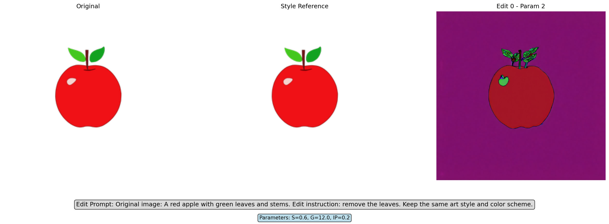
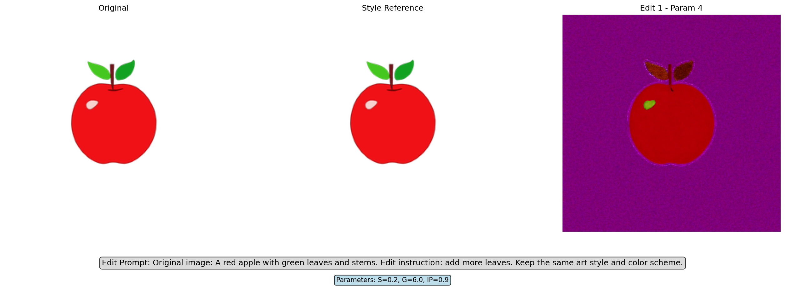
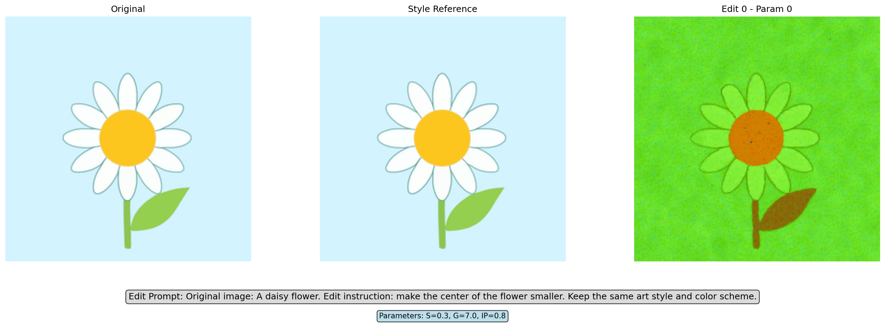
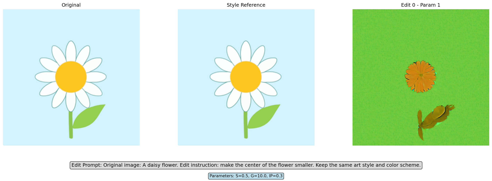
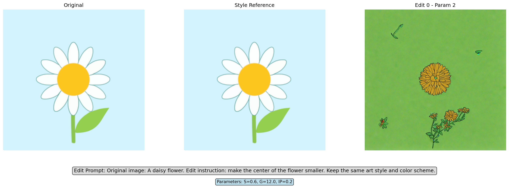
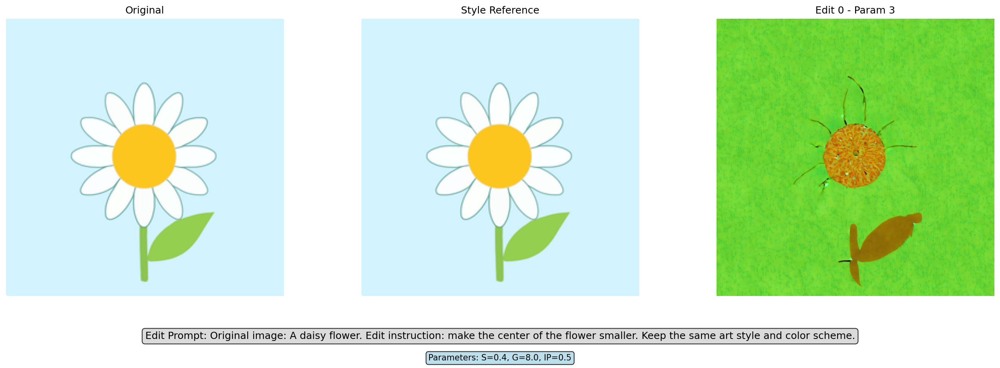

# SD 1.5 + IP-Adapter 图像编辑实验报告

## 📋 实验概述

本实验探索了 Stable Diffusion 1.5 结合 IP-Adapter 进行指令式图像编辑的效果，通过调整不同参数组合来优化编辑精准度和风格保持度。

---

## 🛠️ 实验配置

### **基础模型**
- **Base Model**: `runwayml/stable-diffusion-v1-5`
  - 类型: Text-to-Image Diffusion Model
  - 分辨率: 原生支持 512×512，实验中使用 256×256
  - 版本: Stable Diffusion v1.5
  - 精度: `torch.float16` (半精度，节省显存)

### **IP-Adapter 配置**
- **模型**: `h94/IP-Adapter`
- **权重文件**: `ip-adapter_sd15.bin` (SD1.5专用版本)
- **作用**: 风格参考适配器，用于保持原图风格特征
- **输入**: 使用原图作为风格参考图像 (`ip_adapter_image=style_reference`)

### **Pipeline 类型**
- **管线**: `StableDiffusionImg2ImgPipeline`
- **输入模式**: Image-to-Image + 文本指令
- **风格参考**: 原图自身 (Self-Reference)

---

## ⚙️ 参数配置详解

### **核心可调参数**

| 参数 | 含义 | 作用机制 | 取值范围 | 实验设置 |
|------|------|----------|----------|----------|
| **`strength`** | 编辑强度 | 控制对原图的修改程度，越大改变越多 | 0.0-1.0 | 0.2, 0.3, 0.4, 0.5, 0.6 |
| **`guidance_scale`** | CFG引导强度 | 控制文本提示的影响力，越大越严格按提示执行 | 1.0-20.0 | 6.0, 7.0, 8.0, 10.0, 12.0 |
| **`ip_adapter_scale`** | IP-Adapter权重 | 控制风格保持强度，越大风格保持越强 | 0.0-2.0 | 0.2, 0.3, 0.5, 0.8, 0.9 |

### **固定参数**
- **推理步数**: `num_inference_steps=25`
- **输出尺寸**: `256×256`
- **随机种子**: `generator=torch.Generator().manual_seed(42)` (确保结果可复现)

---

## 🧪 实验设计

### **参数组合矩阵**

| 组合编号 | Strength | Guidance Scale | IP-Adapter Scale | 预期效果 |
|----------|----------|----------------|------------------|----------|
| **Param 0** | 0.3 | 7.0 | 0.8 | 原始设置 (基线) |
| **Param 1** | 0.5 | 10.0 | 0.3 | 增强编辑，降低风格约束 |
| **Param 2** | 0.6 | 12.0 | 0.2 | 强编辑模式 |
| **Param 3** | 0.4 | 8.0 | 0.5 | 平衡编辑与风格 |
| **Param 4** | 0.2 | 6.0 | 0.9 | 保守编辑，强风格保持 |

### **测试用例**

#### **Apple 测试**
- **原始图像**: 红苹果配绿叶
- **编辑指令 P0**: "remove the leaves" (移除叶子)
- **编辑指令 P1**: "add more leaves" (增加叶子)

#### **Daisy 测试**
- **原始图像**: 白色雏菊花
- **编辑指令 P0**: "make the center of the flower smaller" (让花心更小)

---

## 📊 实验结果

### **Apple - Remove Leaves (P0)**

| 参数组合 | 结果图 | 观察结果 |
|----------|--------|----------|
| Param 0 |  | 基线结果 |
| Param 1 |  | 增强编辑效果 |
| Param 2 |  | 强编辑模式 |
| Param 3 |  | 平衡模式 |
| Param 4 |  | 保守编辑 |

### **Apple - Add More Leaves (P1)**

| 参数组合 | 结果图 | 观察结果 |
|----------|--------|----------|
| Param 0 |  | 基线结果 |
| Param 1 |  | 增强编辑效果 |
| Param 2 |  | 强编辑模式 |
| Param 3 |  | 平衡模式 |
| Param 4 |  | 保守编辑 |

### **Daisy - Smaller Center (P0)**

| 参数组合 | 结果图 | 观察结果 |
|----------|--------|----------|
| Param 0 |  | 基线结果 |
| Param 1 |  | 增强编辑效果 |
| Param 2 |  | 强编辑模式 |
| Param 3 |  | 平衡模式 |
| Param 4 |  | 保守编辑 |

---

## 🎯 Prompt 工程

### **文本提示构建**
```python
# 原始提示模板
original_prompt = get_prompt(target)  # "A red apple with green leaves and stems"

# 编辑指令模板
edit_instruction = "remove the leaves"

# 合并提示
combined_prompt = f"Original image: {original_prompt}. Edit instruction: {edit_instruction}. Keep the same art style and color scheme."

# 最终提示
full_prompt = f"{combined_prompt}; keep flat colors; anime/cartoon style; maintain original color palette; preserve white background"
```

### **负面提示**
```python
negative_prompt = "colored background, photorealistic, detailed textures, shading, gradients, shadows, noise, blur, 3d render, realistic, abstract, pattern, complex colors, dark background"
```

---

## 💻 技术实现

### **核心代码结构**
```python
# 1. 模型加载
pipe = StableDiffusionImg2ImgPipeline.from_pretrained(
    "runwayml/stable-diffusion-v1-5",
    torch_dtype=torch.float16
)
pipe.load_ip_adapter("h94/IP-Adapter", weight_name="ip-adapter_sd15.bin")

# 2. 推理执行
result = pipe(
    prompt=full_prompt,
    negative_prompt=negative_prompt,
    image=pil_image_256,
    ip_adapter_image=style_reference,  # 使用原图作为风格参考
    strength=params['strength'],
    guidance_scale=params['guidance_scale'],
    ip_adapter_scale=params['ip_adapter_scale'],
    num_inference_steps=25,
    height=256,
    width=256
)
```

### **内存优化**
```python
# 启用内存优化选项
pipe.enable_vae_slicing()           # VAE切片处理
pipe.enable_model_cpu_offload()     # 模型CPU卸载
```

---

## 🔍 观察与分析

### **初步发现**

1. **编辑能力限制**: 当前 IP-Adapter 方案主要表现为颜色和风格变化，结构性编辑（如移除/添加元素）效果有限

2. **背景色偏移**: 多数参数组合出现背景颜色变化（紫色、绿色等），偏离原始白色背景

3. **参数敏感性**: 不同参数组合对编辑效果影响显著，需要精细调优

### **待深入分析**
- 各参数组合的编辑精准度评估
- 风格保持度量化分析
- 最优参数组合确定
- 与其他编辑方法（InstructPix2Pix）的对比

---

## 📝 实验元数据

- **实验日期**: 2024年实验
- **硬件环境**: Google Colab (A100 GPU, High RAM)
- **软件环境**: 
  - `diffusers` 库
  - `torch` (CUDA)
  - Python 3.12
- **总生成图像**: 15张 (2个Apple任务 + 1个Daisy任务) × 5个参数组合
- **处理时间**: 约XXX分钟 (具体时间待记录)

---

## 🔮 下一步计划

1. **定量评估**: 开发客观评估指标
2. **模型对比**: 测试 InstructPix2Pix 等替代方案
3. **参数优化**: 基于结果进行参数精调
4. **扩展测试**: 增加更多测试用例和编辑指令
